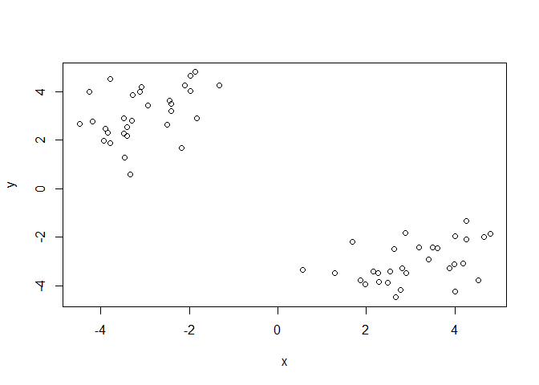
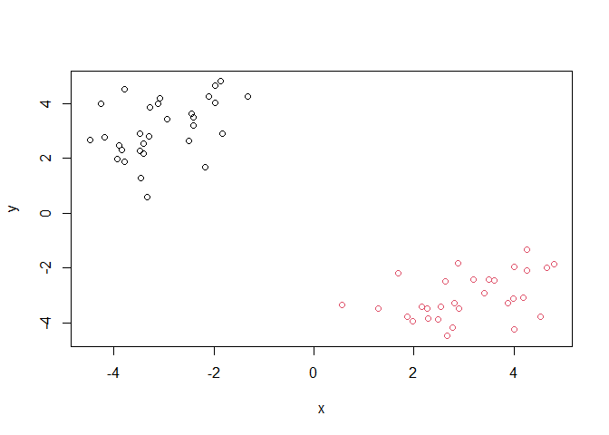
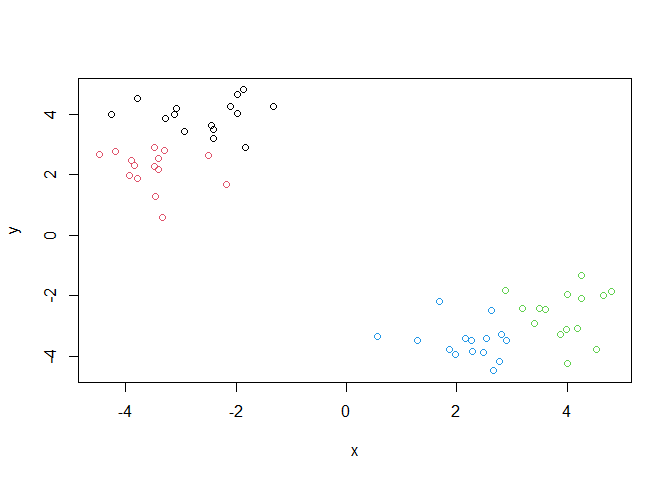
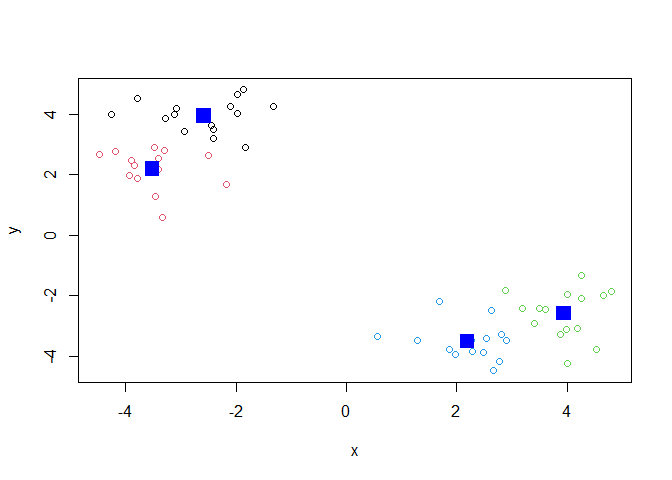
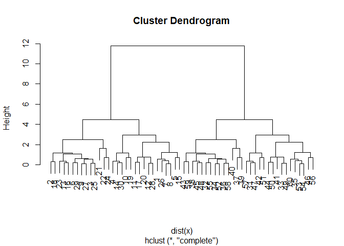
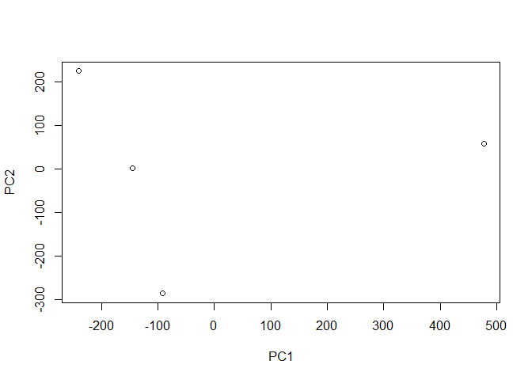
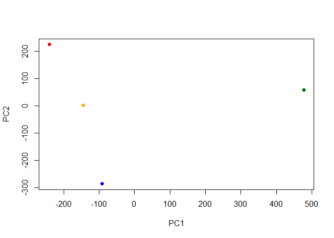
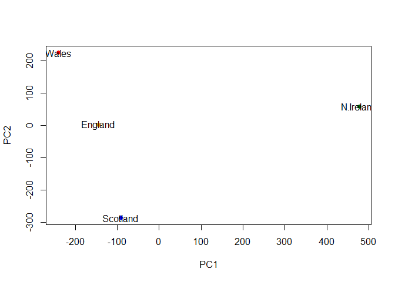
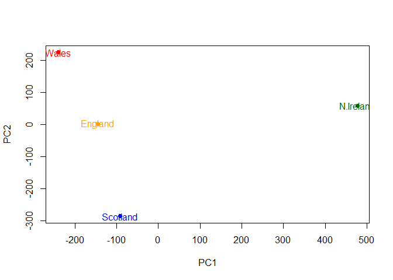

Class 7: Machine Learning 1
================
Kalle Liimatta A59002114
2022-10-19

- <a href="#k-means-clustering" id="toc-k-means-clustering">K-means
  clustering</a>
- <a href="#principal-component-analysis-pca"
  id="toc-principal-component-analysis-pca">Principal component analysis
  (PCA)</a>
  - <a href="#q1.-how-many-rows-and-columns"
    id="toc-q1.-how-many-rows-and-columns"><strong>Q1. How many rows and
    columns?</strong></a>
  - <a
    href="#q2.-which-approach-to-solving-the-row-names-problem-do-you-prefer-and-why"
    id="toc-q2.-which-approach-to-solving-the-row-names-problem-do-you-prefer-and-why"><strong>Q2.
    Which approach to solving the “row-names problem” do you prefer and
    why?</strong></a>
  - <a
    href="#q3.-changing-what-optional-argument-in-the-above-barplot-function-results-in-the-following-plot"
    id="toc-q3.-changing-what-optional-argument-in-the-above-barplot-function-results-in-the-following-plot"><strong>Q3.
    Changing what optional argument in the above barplot() function results
    in the following plot?</strong></a>
  - <a
    href="#q5-generating-all-pairwise-plots-may-help-somewhat.-can-you-make-sense-of-the-following-code-and-resulting-figure-what-does-it-mean-if-a-given-point-lies-on-the-diagonal-for-a-given-plot"
    id="toc-q5-generating-all-pairwise-plots-may-help-somewhat.-can-you-make-sense-of-the-following-code-and-resulting-figure-what-does-it-mean-if-a-given-point-lies-on-the-diagonal-for-a-given-plot"><strong>Q5:
    Generating all pairwise plots may help somewhat. Can you make sense of
    the following code and resulting figure? What does it mean if a given
    point lies on the diagonal for a given plot?</strong></a>
  - <a
    href="#q6.-what-is-the-main-difference-between-n.-ireland-and-the-other-countries-of-the-uk-in-terms-of-this-data-set"
    id="toc-q6.-what-is-the-main-difference-between-n.-ireland-and-the-other-countries-of-the-uk-in-terms-of-this-data-set"><strong>Q6.
    What is the main difference between N. Ireland and the other countries
    of the UK in terms of this data-set?</strong></a>
  - <a
    href="#q7.-complete-the-code-below-to-generate-a-plot-of-pc1-vs-pc2.-the-second-line-adds-text-labels-over-the-data-points"
    id="toc-q7.-complete-the-code-below-to-generate-a-plot-of-pc1-vs-pc2.-the-second-line-adds-text-labels-over-the-data-points"><strong>Q7.
    Complete the code below to generate a plot of PC1 vs PC2. The second
    line adds text labels over the data points</strong></a>
  - <a
    href="#q8.-customize-your-plot-so-that-the-colors-of-the-country-names-match-the-colors-in-our-uk-and-ireland-map-and-table-at-start-of-this-document."
    id="toc-q8.-customize-your-plot-so-that-the-colors-of-the-country-names-match-the-colors-in-our-uk-and-ireland-map-and-table-at-start-of-this-document."><strong>Q8.
    Customize your plot so that the colors of the country names match the
    colors in our UK and Ireland map and table at start of this
    document.</strong></a>
  - <a href="#digging-deeper-variable-loadings"
    id="toc-digging-deeper-variable-loadings">Digging Deeper: Variable
    Loadings</a>

# K-means clustering

K –\> the number of clusters you get. You have to tell it how many
clusters you want.

Let’s make up some data to cluster.

``` r
#rnorm --> will pick numbers from a normal distribution
#you can adjust where the mean falls by adding a number in the second position
tmp <- c(rnorm(30, -3), rnorm(30,3))
x <- cbind(x=tmp, y=rev(tmp))
plot(x)
```



``` r
#rev function reverses your vector
rev(c("a", "b", "C"))
```

    [1] "C" "b" "a"

The function to do k-means clustering in base R is called ‘kmeans()’.

``` r
#for kmeans(), need to worry about x and centers (see the help page)
#x is the data you're clustering
#centers is the number of clusters you want
km <- kmeans(x, centers=4, nstart=20)
km
```

    K-means clustering with 4 clusters of sizes 15, 15, 15, 15

    Cluster means:
              x         y
    1 -2.582202  3.942689
    2 -3.509176  2.192463
    3  3.942689 -2.582202
    4  2.192463 -3.509176

    Clustering vector:
     [1] 1 2 2 1 2 2 1 1 2 1 1 1 2 1 1 2 1 2 1 1 2 2 2 2 2 1 2 1 2 1 3 4 3 4 3 4 4 4
    [39] 4 4 3 3 4 3 4 3 3 4 3 3 3 4 3 3 4 4 3 4 4 3

    Within cluster sum of squares by cluster:
    [1] 13.21912 10.50901 13.21912 10.50901
     (between_SS / total_SS =  96.1 %)

    Available components:

    [1] "cluster"      "centers"      "totss"        "withinss"     "tot.withinss"
    [6] "betweenss"    "size"         "iter"         "ifault"      

What “component” of your result object details:

- cluster size? –\> “size”

``` r
#size will tell you how many points in each cluster
km$size
```

    [1] 15 15 15 15

- cluster assignment/membership? –\> “cluster”

``` r
km$cluster
```

     [1] 1 2 2 1 2 2 1 1 2 1 1 1 2 1 1 2 1 2 1 1 2 2 2 2 2 1 2 1 2 1 3 4 3 4 3 4 4 4
    [39] 4 4 3 3 4 3 4 3 3 4 3 3 3 4 3 3 4 4 3 4 4 3

Q. Plot x colored by the kmeans cluster assignment and add cluster
centers as blue points?

``` r
plot(x, col=c(rep(1,30), rep(2,30)))
```



``` r
plot(x, col=km$cluster)
```



``` r
plot(x, col=km$cluster)
points(km$centers, col="blue", pch=15, cex=2)
```



``` r
km$centers
```

              x         y
    1 -2.582202  3.942689
    2 -3.509176  2.192463
    3  3.942689 -2.582202
    4  2.192463 -3.509176

\#Hierarchical Clustering

The ‘hclust()’ function performs hierarchical clustering. The big
advantage here is that I don’t need to tell it “k”, the number of
clusters…

To run ‘hclust()’ I need to provide a distance matrix as input (not the
original data).

For kmean(), it assumes Euclidean distance

``` r
hc <- hclust( dist(x))
hc
```


    Call:
    hclust(d = dist(x))

    Cluster method   : complete 
    Distance         : euclidean 
    Number of objects: 60 

``` r
plot(hc)
```



``` r
#looking for where the biggest jump is
```

To get my ’main” result (cluster membership), I want to “cut” this tree
to yield “branches” whose leaves are the members of the cluster.

``` r
#h= the height you want to cut the tree at
cutree(hc, h=8)
```

     [1] 1 1 1 1 1 1 1 1 1 1 1 1 1 1 1 1 1 1 1 1 1 1 1 1 1 1 1 1 1 1 2 2 2 2 2 2 2 2
    [39] 2 2 2 2 2 2 2 2 2 2 2 2 2 2 2 2 2 2 2 2 2 2

More often we will use ‘cutree()’ with k=2 for example

``` r
#can also do, give me cut that will give me # clusters
grps <-cutree(hc, k=2)
```

Make a plot of our ‘hclust()’ results i.e. our data colored by cluster
assignment

``` r
plot(x, col=grps)
```


# Principal component analysis (PCA)

Read data for UK food trends from online

``` r
url <- "https://tinyurl.com/UK-foods"
x <- read.csv(url)
x
```

                         X England Wales Scotland N.Ireland
    1               Cheese     105   103      103        66
    2        Carcass_meat      245   227      242       267
    3          Other_meat      685   803      750       586
    4                 Fish     147   160      122        93
    5       Fats_and_oils      193   235      184       209
    6               Sugars     156   175      147       139
    7      Fresh_potatoes      720   874      566      1033
    8           Fresh_Veg      253   265      171       143
    9           Other_Veg      488   570      418       355
    10 Processed_potatoes      198   203      220       187
    11      Processed_Veg      360   365      337       334
    12        Fresh_fruit     1102  1137      957       674
    13            Cereals     1472  1582     1462      1494
    14           Beverages      57    73       53        47
    15        Soft_drinks     1374  1256     1572      1506
    16   Alcoholic_drinks      375   475      458       135
    17      Confectionery       54    64       62        41

## **Q1. How many rows and columns?**

``` r
nrow(x)
```

    [1] 17

``` r
ncol(x)
```

    [1] 5

``` r
dim(x)
```

    [1] 17  5

``` r
head(x)
```

                   X England Wales Scotland N.Ireland
    1         Cheese     105   103      103        66
    2  Carcass_meat      245   227      242       267
    3    Other_meat      685   803      750       586
    4           Fish     147   160      122        93
    5 Fats_and_oils      193   235      184       209
    6         Sugars     156   175      147       139

We are getting 5 columns–\> we want the column with the foods to be our
index

``` r
# Note how the minus indexing works
rownames(x) <- x[,1] #makes the first column the row titles
head(x)
```

                                X England Wales Scotland N.Ireland
    Cheese                 Cheese     105   103      103        66
    Carcass_meat    Carcass_meat      245   227      242       267
    Other_meat        Other_meat      685   803      750       586
    Fish                     Fish     147   160      122        93
    Fats_and_oils  Fats_and_oils      193   235      184       209
    Sugars                 Sugars     156   175      147       139

``` r
#need to get rid of the "X" column which is now duplicated
x <- x[,-1]
head(x)
```

                   England Wales Scotland N.Ireland
    Cheese             105   103      103        66
    Carcass_meat       245   227      242       267
    Other_meat         685   803      750       586
    Fish               147   160      122        93
    Fats_and_oils      193   235      184       209
    Sugars             156   175      147       139

``` r
dim(x)
```

    [1] 17  4

Explore the data-- basically plot, plot, and plot again

``` r
#another way to set the correct row names
x<- read.csv(url, row.names=1)
head(x)
```

                   England Wales Scotland N.Ireland
    Cheese             105   103      103        66
    Carcass_meat       245   227      242       267
    Other_meat         685   803      750       586
    Fish               147   160      122        93
    Fats_and_oils      193   235      184       209
    Sugars             156   175      147       139

## **Q2. Which approach to solving the “row-names problem” do you prefer and why?**

I prefer the second approach using “row.names=1”. This way you don’t
have to worry about your matrix changing if you accidentally run your
code again.

``` r
barplot(as.matrix(x), beside=T, col=rainbow(nrow(x)))
```


## **Q3. Changing what optional argument in the above barplot() function results in the following plot?**

Setting beside to False

``` r
barplot(as.matrix(x), beside=F, col=rainbow(nrow(x)))
```


## **Q5: Generating all pairwise plots may help somewhat. Can you make sense of the following code and resulting figure? What does it mean if a given point lies on the diagonal for a given plot?**

If a point lies on the diagonal, then that food has the same frequency
in both countries displayed.

``` r
pairs(x, col=rainbow(10), pch=16)
```


## **Q6. What is the main difference between N. Ireland and the other countries of the UK in terms of this data-set?**

\#PCA to the rescue!

The main function in base R to do PCA is called ‘prcomp()’.

One annoying thing about prcomp() function is that it expects the
transpose of our data as input. –\> in this case, it wants the foods to
be columns, and the countries to be rows

``` r
t(x)
```

              Cheese Carcass_meat  Other_meat  Fish Fats_and_oils  Sugars
    England      105           245         685  147            193    156
    Wales        103           227         803  160            235    175
    Scotland     103           242         750  122            184    147
    N.Ireland     66           267         586   93            209    139
              Fresh_potatoes  Fresh_Veg  Other_Veg  Processed_potatoes 
    England               720        253        488                 198
    Wales                 874        265        570                 203
    Scotland              566        171        418                 220
    N.Ireland            1033        143        355                 187
              Processed_Veg  Fresh_fruit  Cereals  Beverages Soft_drinks 
    England              360         1102     1472        57         1374
    Wales                365         1137     1582        73         1256
    Scotland             337          957     1462        53         1572
    N.Ireland            334          674     1494        47         1506
              Alcoholic_drinks  Confectionery 
    England                 375             54
    Wales                   475             64
    Scotland                458             62
    N.Ireland               135             41

``` r
pca <- prcomp(t(x))
summary(pca)
```

    Importance of components:
                                PC1      PC2      PC3       PC4
    Standard deviation     324.1502 212.7478 73.87622 4.189e-14
    Proportion of Variance   0.6744   0.2905  0.03503 0.000e+00
    Cumulative Proportion    0.6744   0.9650  1.00000 1.000e+00

``` r
#most important bit is the variance
```

## **Q7. Complete the code below to generate a plot of PC1 vs PC2. The second line adds text labels over the data points**

The object returned by ‘prcomp()’ has our results that include a \$x
component. This is our “scores” along the PCs (i.e. the plot of our data
along the new PC axis).

``` r
pca$x
```

                     PC1         PC2         PC3           PC4
    England   -144.99315    2.532999 -105.768945  2.842865e-14
    Wales     -240.52915  224.646925   56.475555  7.804382e-13
    Scotland   -91.86934 -286.081786   44.415495 -9.614462e-13
    N.Ireland  477.39164   58.901862    4.877895  1.448078e-13

``` r
plot(pca$x[,1], pca$x[,2])
```


``` r
plot(pca$x[,1], pca$x[,2], 
     xlab="PC1", ylab="PC2")
```



``` r
plot(pca$x[,1], pca$x[,2], 
     xlab="PC1", ylab="PC2",
     col=c("orange", "red", "blue", "darkgreen"),
           pch=16)
```



``` r
plot(pca$x[,1], pca$x[,2], 
     xlab="PC1", ylab="PC2",
     col=c("orange", "red", "blue", "darkgreen"),
           pch=16)
text(pca$x[,1], pca$x[,2], colnames(x))
```



## **Q8. Customize your plot so that the colors of the country names match the colors in our UK and Ireland map and table at start of this document.**

``` r
plot(pca$x[,1], pca$x[,2], 
     xlab="PC1", ylab="PC2",
     col=c("orange", "red", "blue", "darkgreen"),
           pch=16)
text(pca$x[,1], pca$x[,2], colnames(x), col=c("orange", "red", "blue", "darkgreen"))
```



## Digging Deeper: Variable Loadings

``` r
## Lets focus on PC1 as it accounts for > 90% of variance 
par(mar=c(10, 3, 0.35, 0))
barplot( pca$rotation[,1], las=2 )
```


