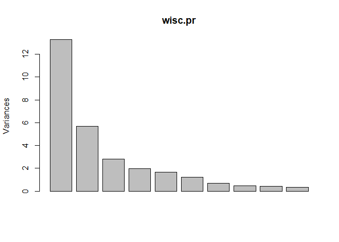
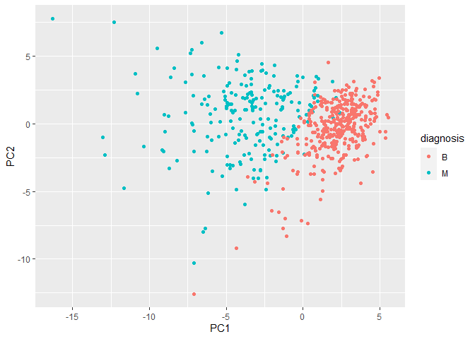
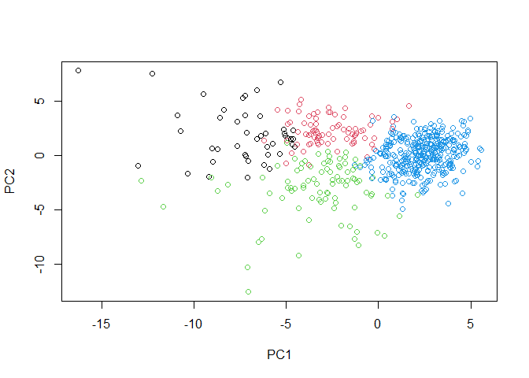

class08 mini-project
================
Kalle Liimatta A59002114
2022-10-21

- <a href="#exploratory-data-analysis"
  id="toc-exploratory-data-analysis">1. Exploratory data analysis</a>
  - <a href="#q1.-how-many-observations-are-in-this-dataset"
    id="toc-q1.-how-many-observations-are-in-this-dataset">Q1. How many
    observations are in this dataset?</a>
    - <a href="#there-are-569-observations-in-this-dataset."
      id="toc-there-are-569-observations-in-this-dataset.">There are 569
      observations in this dataset.</a>
  - <a href="#q2.-how-many-of-the-observations-have-a-malignant-diagnosis"
    id="toc-q2.-how-many-of-the-observations-have-a-malignant-diagnosis">Q2.
    How many of the observations have a malignant diagnosis?</a>
    - <a href="#there-are-212-observations-with-a-malignant-diagnosis."
      id="toc-there-are-212-observations-with-a-malignant-diagnosis.">There
      are 212 observations with a malignant diagnosis.</a>
  - <a
    href="#q3.-how-many-variablesfeatures-in-the-data-are-suffixed-with-_mean"
    id="toc-q3.-how-many-variablesfeatures-in-the-data-are-suffixed-with-_mean">Q3.
    How many variables/features in the data are suffixed with _mean?</a>
    - <a href="#variablesfeatures-are-suffixed-with-_mean."
      id="toc-variablesfeatures-are-suffixed-with-_mean.">10
      variables/features are suffixed with “_mean”.</a>
- <a href="#principal-component-analysis"
  id="toc-principal-component-analysis">2. Principal Component
  Analysis</a>
  - <a
    href="#q4.-from-your-results-what-proportion-of-the-original-variance-is-captured-by-the-first-principal-components-pc1"
    id="toc-q4.-from-your-results-what-proportion-of-the-original-variance-is-captured-by-the-first-principal-components-pc1">Q4.
    From your results, what proportion of the original variance is captured
    by the first principal components (PC1)?</a>
    - <a href="#pc1-captured-44.27-of-the-variance-in-the-original-data."
      id="toc-pc1-captured-44.27-of-the-variance-in-the-original-data.">PC1
      captured 44.27% of the variance in the original data.</a>
  - <a
    href="#q5.-how-many-principal-components-pcs-are-required-to-describe-at-least-70-of-the-original-variance-in-the-data"
    id="toc-q5.-how-many-principal-components-pcs-are-required-to-describe-at-least-70-of-the-original-variance-in-the-data">Q5.
    How many principal components (PCs) are required to describe at least
    70% of the original variance in the data?</a>
    - <a
      href="#three-principle-components-are-required-to-describe-at-least-70-of-the-original-variance-as-shown-by-the-cumulative-proportion-row."
      id="toc-three-principle-components-are-required-to-describe-at-least-70-of-the-original-variance-as-shown-by-the-cumulative-proportion-row.">Three
      principle components are required to describe at least 70% of the
      original variance (as shown by the cumulative proportion row).</a>
  - <a
    href="#q6.-how-many-principal-components-pcs-are-required-to-describe-at-least-90-of-the-original-variance-in-the-data"
    id="toc-q6.-how-many-principal-components-pcs-are-required-to-describe-at-least-90-of-the-original-variance-in-the-data">Q6.
    How many principal components (PCs) are required to describe at least
    90% of the original variance in the data?</a>
    - <a href="#seven-are-required." id="toc-seven-are-required.">Seven are
      required.</a>
  - <a
    href="#q7.-what-stands-out-to-you-about-this-plot-is-it-easy-or-difficult-to-understand-why"
    id="toc-q7.-what-stands-out-to-you-about-this-plot-is-it-easy-or-difficult-to-understand-why">Q7.
    What stands out to you about this plot? Is it easy or difficult to
    understand? Why?</a>
    - <a
      href="#its-very-messy-and-difficult-to-understand.-there-are-a-lot-of-labelled-things-that-make-it-impossible-to-see-the-plot."
      id="toc-its-very-messy-and-difficult-to-understand.-there-are-a-lot-of-labelled-things-that-make-it-impossible-to-see-the-plot.">It’s
      very messy and difficult to understand. There are a lot of labelled
      things that make it impossible to see the plot.</a>
  - <a
    href="#q8.-generate-a-similar-plot-for-principal-components-1-and-3.-what-do-you-notice-about-these-plots"
    id="toc-q8.-generate-a-similar-plot-for-principal-components-1-and-3.-what-do-you-notice-about-these-plots">Q8.
    Generate a similar plot for principal components 1 and 3. What do you
    notice about these plots?</a>
    - <a
      href="#the-groups-in-this-plot-are-not-as-separated-as-in-the-pc1-vs-pc2-plot-since-pc3-doesnt-capture-as-much-variance-as-pc2.-but-the-two-groups-are-still-distinct-so-pc1-is-enough-to-distinguish-for-the-most-part-between-benign-and-malignant."
      id="toc-the-groups-in-this-plot-are-not-as-separated-as-in-the-pc1-vs-pc2-plot-since-pc3-doesnt-capture-as-much-variance-as-pc2.-but-the-two-groups-are-still-distinct-so-pc1-is-enough-to-distinguish-for-the-most-part-between-benign-and-malignant.">The
      groups in this plot are not as separated as in the PC1 vs PC2 plot since
      PC3 doesn’t capture as much variance as PC2. But the two groups are
      still distinct, so PC1 is enough to distinguish for the most part
      between benign and malignant.</a>
  - <a
    href="#q9.-for-the-first-principal-component-what-is-the-component-of-the-loading-vector-i.e.-wisc.prrotation1-for-the-feature-concave.points_mean-this-tells-us-how-much-this-original-feature-contributes-to-the-first-pc."
    id="toc-q9.-for-the-first-principal-component-what-is-the-component-of-the-loading-vector-i.e.-wisc.prrotation1-for-the-feature-concave.points_mean-this-tells-us-how-much-this-original-feature-contributes-to-the-first-pc.">Q9.
    For the first principal component, what is the component of the loading
    vector (i.e. wisc.pr$rotation[,1]) for the feature concave.points_mean?
    This tells us how much this original feature contributes to the first
    PC.</a>
    - <a
      href="#is-the-component-of-the-loading-vector-for-the-feature-concave.points_mean."
      id="toc-is-the-component-of-the-loading-vector-for-the-feature-concave.points_mean.">-0.26085376
      is the component of the loading vector for the feature
      concave.points_mean.</a>
- <a href="#hierarchical-clustering" id="toc-hierarchical-clustering">3.
  Hierarchical clustering</a>
  - <a
    href="#q10.-using-the-plot-and-abline-functions-what-is-the-height-at-which-the-clustering-model-has-4-clusters"
    id="toc-q10.-using-the-plot-and-abline-functions-what-is-the-height-at-which-the-clustering-model-has-4-clusters">Q10.
    Using the plot() and abline() functions, what is the height at which the
    clustering model has 4 clusters?</a>
    - <a href="#height-19" id="toc-height-19">Height = 19</a>
  - <a
    href="#q12.-which-method-gives-your-favorite-results-for-the-same-data.dist-dataset-explain-your-reasoning."
    id="toc-q12.-which-method-gives-your-favorite-results-for-the-same-data.dist-dataset-explain-your-reasoning.">Q12.
    Which method gives your favorite results for the same data.dist dataset?
    Explain your reasoning.</a>
    - <a
      href="#ward.d2-gives-my-favorite-results-because-it-produces-the-clearest-looking-groupings.-its-nice-that-it-minimizes-variance-within-the-clusters."
      id="toc-ward.d2-gives-my-favorite-results-because-it-produces-the-clearest-looking-groupings.-its-nice-that-it-minimizes-variance-within-the-clusters.">Ward.D2
      gives my favorite results because it produces the clearest looking
      groupings. It’s nice that it minimizes variance within the clusters.</a>
- <a href="#combining-methods" id="toc-combining-methods">4. Combining
  methods</a>
  - <a
    href="#q13.-how-well-does-the-newly-created-model-with-four-clusters-separate-out-the-two-diagnoses"
    id="toc-q13.-how-well-does-the-newly-created-model-with-four-clusters-separate-out-the-two-diagnoses">Q13.
    How well does the newly created model with four clusters separate out
    the two diagnoses?</a>
    - <a
      href="#it-separates-out-very-similarly-to-when-two-clusters-were-madewith-there-being-28-and-24-samples-in-the-benign-and-malignant-groups-being-misdiagnosed."
      id="toc-it-separates-out-very-similarly-to-when-two-clusters-were-madewith-there-being-28-and-24-samples-in-the-benign-and-malignant-groups-being-misdiagnosed.">It
      separates out very similarly to when two clusters were made–with there
      being 28 and 24 samples in the Benign and Malignant groups being
      “misdiagnosed”.</a>
  - <a
    href="#q14.-how-well-do-the-hierarchical-clustering-models-you-created-in-previous-sections-i.e.-before-pca-do-in-terms-of-separating-the-diagnoses"
    id="toc-q14.-how-well-do-the-hierarchical-clustering-models-you-created-in-previous-sections-i.e.-before-pca-do-in-terms-of-separating-the-diagnoses">Q14.
    How well do the hierarchical clustering models you created in previous
    sections (i.e. before PCA) do in terms of separating the diagnoses?</a>
    - <a
      href="#overall-the-pca-clustering-model-seems-to-do-the-best-has-the-least-total-samples-being-misdiagnosed-but-the-kmeans-and-hierarchical-clustering-models-also-do-a-good-job-of-clustering-them-with-hierarchical-clustering-being-better-than-kmeans."
      id="toc-overall-the-pca-clustering-model-seems-to-do-the-best-has-the-least-total-samples-being-misdiagnosed-but-the-kmeans-and-hierarchical-clustering-models-also-do-a-good-job-of-clustering-them-with-hierarchical-clustering-being-better-than-kmeans.">Overall,
      the PCA clustering model seems to do the best (has the least total
      samples being “misdiagnosed”), but the kmeans and hierarchical
      clustering models also do a good job of clustering them, with
      hierarchical clustering being better than kmeans.</a>
- <a href="#sensitivityspecificity" id="toc-sensitivityspecificity">5.
  Sensitivity/Specificity</a>
- <a href="#prediction" id="toc-prediction">6. Prediction</a>
  - <a
    href="#q16.-which-of-these-new-patients-should-we-prioritize-for-follow-up-based-on-your-results"
    id="toc-q16.-which-of-these-new-patients-should-we-prioritize-for-follow-up-based-on-your-results">Q16.
    Which of these new patients should we prioritize for follow up based on
    your results?</a>
    - <a
      href="#patient-2-because-they-are-in-the-cluster-where-the-majority-of-samples-are-malignant."
      id="toc-patient-2-because-they-are-in-the-cluster-where-the-majority-of-samples-are-malignant.">Patient
      2 because they are in the cluster where the majority of samples are
      malignant.</a>

# 1. Exploratory data analysis

``` r
#Data files were saved in my project folder
fna.data <- "WisconsinCancer.csv"

#will store the data in a dataframe called wisc.df
wisc.df <- read.csv(fna.data, row.names=1)
head(wisc.df)
```

             diagnosis radius_mean texture_mean perimeter_mean area_mean
    842302           M       17.99        10.38         122.80    1001.0
    842517           M       20.57        17.77         132.90    1326.0
    84300903         M       19.69        21.25         130.00    1203.0
    84348301         M       11.42        20.38          77.58     386.1
    84358402         M       20.29        14.34         135.10    1297.0
    843786           M       12.45        15.70          82.57     477.1
             smoothness_mean compactness_mean concavity_mean concave.points_mean
    842302           0.11840          0.27760         0.3001             0.14710
    842517           0.08474          0.07864         0.0869             0.07017
    84300903         0.10960          0.15990         0.1974             0.12790
    84348301         0.14250          0.28390         0.2414             0.10520
    84358402         0.10030          0.13280         0.1980             0.10430
    843786           0.12780          0.17000         0.1578             0.08089
             symmetry_mean fractal_dimension_mean radius_se texture_se perimeter_se
    842302          0.2419                0.07871    1.0950     0.9053        8.589
    842517          0.1812                0.05667    0.5435     0.7339        3.398
    84300903        0.2069                0.05999    0.7456     0.7869        4.585
    84348301        0.2597                0.09744    0.4956     1.1560        3.445
    84358402        0.1809                0.05883    0.7572     0.7813        5.438
    843786          0.2087                0.07613    0.3345     0.8902        2.217
             area_se smoothness_se compactness_se concavity_se concave.points_se
    842302    153.40      0.006399        0.04904      0.05373           0.01587
    842517     74.08      0.005225        0.01308      0.01860           0.01340
    84300903   94.03      0.006150        0.04006      0.03832           0.02058
    84348301   27.23      0.009110        0.07458      0.05661           0.01867
    84358402   94.44      0.011490        0.02461      0.05688           0.01885
    843786     27.19      0.007510        0.03345      0.03672           0.01137
             symmetry_se fractal_dimension_se radius_worst texture_worst
    842302       0.03003             0.006193        25.38         17.33
    842517       0.01389             0.003532        24.99         23.41
    84300903     0.02250             0.004571        23.57         25.53
    84348301     0.05963             0.009208        14.91         26.50
    84358402     0.01756             0.005115        22.54         16.67
    843786       0.02165             0.005082        15.47         23.75
             perimeter_worst area_worst smoothness_worst compactness_worst
    842302            184.60     2019.0           0.1622            0.6656
    842517            158.80     1956.0           0.1238            0.1866
    84300903          152.50     1709.0           0.1444            0.4245
    84348301           98.87      567.7           0.2098            0.8663
    84358402          152.20     1575.0           0.1374            0.2050
    843786            103.40      741.6           0.1791            0.5249
             concavity_worst concave.points_worst symmetry_worst
    842302            0.7119               0.2654         0.4601
    842517            0.2416               0.1860         0.2750
    84300903          0.4504               0.2430         0.3613
    84348301          0.6869               0.2575         0.6638
    84358402          0.4000               0.1625         0.2364
    843786            0.5355               0.1741         0.3985
             fractal_dimension_worst
    842302                   0.11890
    842517                   0.08902
    84300903                 0.08758
    84348301                 0.17300
    84358402                 0.07678
    843786                   0.12440

``` r
#omitting the diagnosis column as we will not be using it for our analysis
# We can use -1 here to remove the first column
wisc.data <- wisc.df[,-1]
head(wisc.data)
```

             radius_mean texture_mean perimeter_mean area_mean smoothness_mean
    842302         17.99        10.38         122.80    1001.0         0.11840
    842517         20.57        17.77         132.90    1326.0         0.08474
    84300903       19.69        21.25         130.00    1203.0         0.10960
    84348301       11.42        20.38          77.58     386.1         0.14250
    84358402       20.29        14.34         135.10    1297.0         0.10030
    843786         12.45        15.70          82.57     477.1         0.12780
             compactness_mean concavity_mean concave.points_mean symmetry_mean
    842302            0.27760         0.3001             0.14710        0.2419
    842517            0.07864         0.0869             0.07017        0.1812
    84300903          0.15990         0.1974             0.12790        0.2069
    84348301          0.28390         0.2414             0.10520        0.2597
    84358402          0.13280         0.1980             0.10430        0.1809
    843786            0.17000         0.1578             0.08089        0.2087
             fractal_dimension_mean radius_se texture_se perimeter_se area_se
    842302                  0.07871    1.0950     0.9053        8.589  153.40
    842517                  0.05667    0.5435     0.7339        3.398   74.08
    84300903                0.05999    0.7456     0.7869        4.585   94.03
    84348301                0.09744    0.4956     1.1560        3.445   27.23
    84358402                0.05883    0.7572     0.7813        5.438   94.44
    843786                  0.07613    0.3345     0.8902        2.217   27.19
             smoothness_se compactness_se concavity_se concave.points_se
    842302        0.006399        0.04904      0.05373           0.01587
    842517        0.005225        0.01308      0.01860           0.01340
    84300903      0.006150        0.04006      0.03832           0.02058
    84348301      0.009110        0.07458      0.05661           0.01867
    84358402      0.011490        0.02461      0.05688           0.01885
    843786        0.007510        0.03345      0.03672           0.01137
             symmetry_se fractal_dimension_se radius_worst texture_worst
    842302       0.03003             0.006193        25.38         17.33
    842517       0.01389             0.003532        24.99         23.41
    84300903     0.02250             0.004571        23.57         25.53
    84348301     0.05963             0.009208        14.91         26.50
    84358402     0.01756             0.005115        22.54         16.67
    843786       0.02165             0.005082        15.47         23.75
             perimeter_worst area_worst smoothness_worst compactness_worst
    842302            184.60     2019.0           0.1622            0.6656
    842517            158.80     1956.0           0.1238            0.1866
    84300903          152.50     1709.0           0.1444            0.4245
    84348301           98.87      567.7           0.2098            0.8663
    84358402          152.20     1575.0           0.1374            0.2050
    843786            103.40      741.6           0.1791            0.5249
             concavity_worst concave.points_worst symmetry_worst
    842302            0.7119               0.2654         0.4601
    842517            0.2416               0.1860         0.2750
    84300903          0.4504               0.2430         0.3613
    84348301          0.6869               0.2575         0.6638
    84358402          0.4000               0.1625         0.2364
    843786            0.5355               0.1741         0.3985
             fractal_dimension_worst
    842302                   0.11890
    842517                   0.08902
    84300903                 0.08758
    84348301                 0.17300
    84358402                 0.07678
    843786                   0.12440

``` r
# setup a separate new vector called diagnosis that contains the data from the diagnosis column of the original dataset. We will store this as a factor (useful for plotting) and use this later to check our results.
diagnosis <- as.factor(wisc.df$diagnosis)
head(diagnosis)
```

    [1] M M M M M M
    Levels: B M

## Q1. How many observations are in this dataset?

``` r
nrow(wisc.data)
```

    [1] 569

### There are 569 observations in this dataset.

## Q2. How many of the observations have a malignant diagnosis?

``` r
table(diagnosis)
```

    diagnosis
      B   M 
    357 212 

### There are 212 observations with a malignant diagnosis.

## Q3. How many variables/features in the data are suffixed with \_mean?

``` r
wisc.colnames <- colnames(wisc.data)
wisc.colnames
```

     [1] "radius_mean"             "texture_mean"           
     [3] "perimeter_mean"          "area_mean"              
     [5] "smoothness_mean"         "compactness_mean"       
     [7] "concavity_mean"          "concave.points_mean"    
     [9] "symmetry_mean"           "fractal_dimension_mean" 
    [11] "radius_se"               "texture_se"             
    [13] "perimeter_se"            "area_se"                
    [15] "smoothness_se"           "compactness_se"         
    [17] "concavity_se"            "concave.points_se"      
    [19] "symmetry_se"             "fractal_dimension_se"   
    [21] "radius_worst"            "texture_worst"          
    [23] "perimeter_worst"         "area_worst"             
    [25] "smoothness_worst"        "compactness_worst"      
    [27] "concavity_worst"         "concave.points_worst"   
    [29] "symmetry_worst"          "fractal_dimension_worst"

``` r
#find the columns that have _mean in their names
grep("_mean", wisc.colnames)
```

     [1]  1  2  3  4  5  6  7  8  9 10

``` r
#count the number of columns that have _mean in their names
length(grep("_mean", wisc.colnames))
```

    [1] 10

### 10 variables/features are suffixed with “\_mean”.

# 2. Principal Component Analysis

Let’s try PCA on this data to see what major features might be hidden in
this high dimensional data that are hard to see any other way.

First, we need to check if the data need to be scaled. Two reasons for
scaling data include.

- The input variables use different units of measurement.

- The input variables have significantly different variances.

``` r
# check the mean and stdev of the features to determine if the data should be scaled
#check column means and stdevs
round(colMeans(wisc.data))
```

                radius_mean            texture_mean          perimeter_mean 
                         14                      19                      92 
                  area_mean         smoothness_mean        compactness_mean 
                        655                       0                       0 
             concavity_mean     concave.points_mean           symmetry_mean 
                          0                       0                       0 
     fractal_dimension_mean               radius_se              texture_se 
                          0                       0                       1 
               perimeter_se                 area_se           smoothness_se 
                          3                      40                       0 
             compactness_se            concavity_se       concave.points_se 
                          0                       0                       0 
                symmetry_se    fractal_dimension_se            radius_worst 
                          0                       0                      16 
              texture_worst         perimeter_worst              area_worst 
                         26                     107                     881 
           smoothness_worst       compactness_worst         concavity_worst 
                          0                       0                       0 
       concave.points_worst          symmetry_worst fractal_dimension_worst 
                          0                       0                       0 

``` r
round(apply(wisc.data,2,sd))
```

                radius_mean            texture_mean          perimeter_mean 
                          4                       4                      24 
                  area_mean         smoothness_mean        compactness_mean 
                        352                       0                       0 
             concavity_mean     concave.points_mean           symmetry_mean 
                          0                       0                       0 
     fractal_dimension_mean               radius_se              texture_se 
                          0                       0                       1 
               perimeter_se                 area_se           smoothness_se 
                          2                      45                       0 
             compactness_se            concavity_se       concave.points_se 
                          0                       0                       0 
                symmetry_se    fractal_dimension_se            radius_worst 
                          0                       0                       5 
              texture_worst         perimeter_worst              area_worst 
                          6                      34                     569 
           smoothness_worst       compactness_worst         concavity_worst 
                          0                       0                       0 
       concave.points_worst          symmetry_worst fractal_dimension_worst 
                          0                       0                       0 

``` r
wisc.pr <- prcomp(wisc.data, scale. = TRUE)
summary(wisc.pr)
```

    Importance of components:
                              PC1    PC2     PC3     PC4     PC5     PC6     PC7
    Standard deviation     3.6444 2.3857 1.67867 1.40735 1.28403 1.09880 0.82172
    Proportion of Variance 0.4427 0.1897 0.09393 0.06602 0.05496 0.04025 0.02251
    Cumulative Proportion  0.4427 0.6324 0.72636 0.79239 0.84734 0.88759 0.91010
                               PC8    PC9    PC10   PC11    PC12    PC13    PC14
    Standard deviation     0.69037 0.6457 0.59219 0.5421 0.51104 0.49128 0.39624
    Proportion of Variance 0.01589 0.0139 0.01169 0.0098 0.00871 0.00805 0.00523
    Cumulative Proportion  0.92598 0.9399 0.95157 0.9614 0.97007 0.97812 0.98335
                              PC15    PC16    PC17    PC18    PC19    PC20   PC21
    Standard deviation     0.30681 0.28260 0.24372 0.22939 0.22244 0.17652 0.1731
    Proportion of Variance 0.00314 0.00266 0.00198 0.00175 0.00165 0.00104 0.0010
    Cumulative Proportion  0.98649 0.98915 0.99113 0.99288 0.99453 0.99557 0.9966
                              PC22    PC23   PC24    PC25    PC26    PC27    PC28
    Standard deviation     0.16565 0.15602 0.1344 0.12442 0.09043 0.08307 0.03987
    Proportion of Variance 0.00091 0.00081 0.0006 0.00052 0.00027 0.00023 0.00005
    Cumulative Proportion  0.99749 0.99830 0.9989 0.99942 0.99969 0.99992 0.99997
                              PC29    PC30
    Standard deviation     0.02736 0.01153
    Proportion of Variance 0.00002 0.00000
    Cumulative Proportion  1.00000 1.00000

``` r
#shows that PC1 captured 44.3% of the variance in the original data
```

## Q4. From your results, what proportion of the original variance is captured by the first principal components (PC1)?

### PC1 captured 44.27% of the variance in the original data.

## Q5. How many principal components (PCs) are required to describe at least 70% of the original variance in the data?

### Three principle components are required to describe at least 70% of the original variance (as shown by the cumulative proportion row).

## Q6. How many principal components (PCs) are required to describe at least 90% of the original variance in the data?

### Seven are required.

``` r
plot(wisc.pr)
```



One of our main results from methods like PCA is a so called “score
plots” aka ’PC plots”, “ordination plot”, PC1 vs PC2…

``` r
biplot(wisc.pr)
```


## Q7. What stands out to you about this plot? Is it easy or difficult to understand? Why?

### It’s very messy and difficult to understand. There are a lot of labelled things that make it impossible to see the plot.

``` r
head(wisc.pr$x)
```

                   PC1        PC2        PC3       PC4        PC5         PC6
    842302   -9.184755  -1.946870 -1.1221788 3.6305364  1.1940595  1.41018364
    842517   -2.385703   3.764859 -0.5288274 1.1172808 -0.6212284  0.02863116
    84300903 -5.728855   1.074229 -0.5512625 0.9112808  0.1769302  0.54097615
    84348301 -7.116691 -10.266556 -3.2299475 0.1524129  2.9582754  3.05073750
    84358402 -3.931842   1.946359  1.3885450 2.9380542 -0.5462667 -1.22541641
    843786   -2.378155  -3.946456 -2.9322967 0.9402096  1.0551135 -0.45064213
                     PC7         PC8         PC9       PC10       PC11       PC12
    842302    2.15747152  0.39805698 -0.15698023 -0.8766305 -0.2627243 -0.8582593
    842517    0.01334635 -0.24077660 -0.71127897  1.1060218 -0.8124048  0.1577838
    84300903 -0.66757908 -0.09728813  0.02404449  0.4538760  0.6050715  0.1242777
    84348301  1.42865363 -1.05863376 -1.40420412 -1.1159933  1.1505012  1.0104267
    84358402 -0.93538950 -0.63581661 -0.26357355  0.3773724 -0.6507870 -0.1104183
    843786    0.49001396  0.16529843 -0.13335576 -0.5299649 -0.1096698  0.0813699
                    PC13         PC14         PC15        PC16        PC17
    842302    0.10329677 -0.690196797  0.601264078  0.74446075 -0.26523740
    842517   -0.94269981 -0.652900844 -0.008966977 -0.64823831 -0.01719707
    84300903 -0.41026561  0.016665095 -0.482994760  0.32482472  0.19075064
    84348301 -0.93245070 -0.486988399  0.168699395  0.05132509  0.48220960
    84358402  0.38760691 -0.538706543 -0.310046684 -0.15247165  0.13302526
    843786   -0.02625135  0.003133944 -0.178447576 -0.01270566  0.19671335
                    PC18       PC19        PC20         PC21        PC22
    842302   -0.54907956  0.1336499  0.34526111  0.096430045 -0.06878939
    842517    0.31801756 -0.2473470 -0.11403274 -0.077259494  0.09449530
    84300903 -0.08789759 -0.3922812 -0.20435242  0.310793246  0.06025601
    84348301 -0.03584323 -0.0267241 -0.46432511  0.433811661  0.20308706
    84358402 -0.01869779  0.4610302  0.06543782 -0.116442469  0.01763433
    843786   -0.29727706 -0.1297265 -0.07117453 -0.002400178  0.10108043
                    PC23         PC24         PC25         PC26        PC27
    842302    0.08444429  0.175102213  0.150887294 -0.201326305 -0.25236294
    842517   -0.21752666 -0.011280193  0.170360355 -0.041092627  0.18111081
    84300903 -0.07422581 -0.102671419 -0.171007656  0.004731249  0.04952586
    84348301 -0.12399554 -0.153294780 -0.077427574 -0.274982822  0.18330078
    84358402  0.13933105  0.005327110 -0.003059371  0.039219780  0.03213957
    843786    0.03344819 -0.002837749 -0.122282765 -0.030272333 -0.08438081
                      PC28         PC29          PC30
    842302   -0.0338846387  0.045607590  0.0471277407
    842517    0.0325955021 -0.005682424  0.0018662342
    84300903  0.0469844833  0.003143131 -0.0007498749
    84348301  0.0424469831 -0.069233868  0.0199198881
    84358402 -0.0347556386  0.005033481 -0.0211951203
    843786    0.0007296587 -0.019703996 -0.0034564331

``` r
#plot PC1 vs PC2
plot(wisc.pr$x[,1], wisc.pr$x[,2], col=diagnosis,
     xlab= "PC1", ylab="PC2")
```


``` r
#each dot is a patient sample
```

## Q8. Generate a similar plot for principal components 1 and 3. What do you notice about these plots?

``` r
plot(wisc.pr$x[,1], wisc.pr$x[,3], col=diagnosis,
     xlab= "PC1", ylab="PC3")
```


### The groups in this plot are not as separated as in the PC1 vs PC2 plot since PC3 doesn’t capture as much variance as PC2. But the two groups are still distinct, so PC1 is enough to distinguish for the most part between benign and malignant.

``` r
# Create a data.frame for ggplot
df <- as.data.frame(wisc.pr$x)
df$diagnosis <- diagnosis
```

``` r
# Load the ggplot2 package
library(ggplot2)
```

``` r
# Make a scatter plot colored by diagnosis
ggplot(df) + 
  aes(PC1, PC2, col=diagnosis) +
  geom_point() +
  labs(x="PC1", y="PC2")
```



## Q9. For the first principal component, what is the component of the loading vector (i.e. wisc.pr\$rotation\[,1\]) for the feature concave.points_mean? This tells us how much this original feature contributes to the first PC.

``` r
wisc.pr$rotation[,1]
```

                radius_mean            texture_mean          perimeter_mean 
                -0.21890244             -0.10372458             -0.22753729 
                  area_mean         smoothness_mean        compactness_mean 
                -0.22099499             -0.14258969             -0.23928535 
             concavity_mean     concave.points_mean           symmetry_mean 
                -0.25840048             -0.26085376             -0.13816696 
     fractal_dimension_mean               radius_se              texture_se 
                -0.06436335             -0.20597878             -0.01742803 
               perimeter_se                 area_se           smoothness_se 
                -0.21132592             -0.20286964             -0.01453145 
             compactness_se            concavity_se       concave.points_se 
                -0.17039345             -0.15358979             -0.18341740 
                symmetry_se    fractal_dimension_se            radius_worst 
                -0.04249842             -0.10256832             -0.22799663 
              texture_worst         perimeter_worst              area_worst 
                -0.10446933             -0.23663968             -0.22487053 
           smoothness_worst       compactness_worst         concavity_worst 
                -0.12795256             -0.21009588             -0.22876753 
       concave.points_worst          symmetry_worst fractal_dimension_worst 
                -0.25088597             -0.12290456             -0.13178394 

### -0.26085376 is the component of the loading vector for the feature concave.points_mean.

# 3. Hierarchical clustering

``` r
# Scale the wisc.data data using the "scale()" function
data.scaled <- scale(wisc.data)
```

``` r
#Calculate the (Euclidean) distances between all pairs of observations in the new scaled dataset
data.dist <- dist(data.scaled, method="euclidean")
head(data.dist)
```

    [1] 10.309426  6.771675 10.463467  8.663413  8.402233  9.843286

``` r
#Create a hierarchical clustering model using complete linkage. Manually specify the method argument to hclust()
wisc.hclust <- hclust(data.dist, method="complete")
```

## Q10. Using the plot() and abline() functions, what is the height at which the clustering model has 4 clusters?

``` r
plot(wisc.hclust)
abline(h=19, col="red", lty=2)
```


### Height = 19

## Q12. Which method gives your favorite results for the same data.dist dataset? Explain your reasoning.

``` r
single_method <- hclust(data.dist, method="single")
plot(single_method)
```


``` r
average_method <- hclust(data.dist, method="average")
plot(average_method)
```


``` r
ward.D2_method <- hclust(data.dist, method="ward.D2")
plot(ward.D2_method)
```


### Ward.D2 gives my favorite results because it produces the clearest looking groupings. It’s nice that it minimizes variance within the clusters.

# 4. Combining methods

``` r
wisc.pr.hclust<- hclust(dist(wisc.pr$x[,1:7]), method="ward.D2")
```

``` r
grps <- cutree(wisc.pr.hclust, k=2)
table(grps)
```

    grps
      1   2 
    216 353 

``` r
table(grps, diagnosis)
```

        diagnosis
    grps   B   M
       1  28 188
       2 329  24

``` r
plot(wisc.pr$x[,1:2], col=grps)
```


``` r
plot(wisc.pr$x[,1:2], col=diagnosis)
```


Note the color swap here as the hclust cluster 1 is mostly “M” and
cluster 2 is mostly “B” as we saw from the results of calling
table(grps, diagnosis). To match things up we can turn our groups into a
factor and reorder the levels so cluster 2 comes first and thus gets the
first color (black) and cluster 1 gets the second color (red).

``` r
g <- as.factor(grps)
levels(g)
```

    [1] "1" "2"

``` r
g <- relevel(g,2)
levels(g)
```

    [1] "2" "1"

``` r
# Plot using our re-ordered factor 
plot(wisc.pr$x[,1:2], col=g)
```


We can be fancy and look in 3D with the rgl or plotly packages.

``` r
#install.packages("rgl")
```

``` r
library(rgl)
```

``` r
plot3d(wisc.pr$x[,1:3], xlab="PC 1", ylab="PC 2", zlab="PC 3", cex=1.5, size=1, type="s", col=grps)
```

## Q13. How well does the newly created model with four clusters separate out the two diagnoses?

``` r
table(grps, diagnosis)
```

        diagnosis
    grps   B   M
       1  28 188
       2 329  24

``` r
grps4 <- cutree(wisc.pr.hclust, k=4)
table(grps4)
```

    grps4
      1   2   3   4 
     45  79  92 353 

``` r
table(grps4, diagnosis)
```

         diagnosis
    grps4   B   M
        1   0  45
        2   2  77
        3  26  66
        4 329  24

``` r
plot(wisc.pr$x[,1:7], col=grps4)
```



``` r
plot(wisc.pr$x[,1:2], col=g)
```


### It separates out very similarly to when two clusters were made–with there being 28 and 24 samples in the Benign and Malignant groups being “misdiagnosed”.

## Q14. How well do the hierarchical clustering models you created in previous sections (i.e. before PCA) do in terms of separating the diagnoses?

``` r
#k-means clustering method
km_method <- kmeans(wisc.data, centers=2)
km_method$cluster
```

       842302    842517  84300903  84348301  84358402    843786    844359  84458202 
            2         2         2         1         2         1         2         1 
       844981  84501001    845636  84610002    846226    846381  84667401  84799002 
            1         1         1         2         2         1         1         1 
       848406  84862001    849014   8510426   8510653   8510824   8511133    851509 
            1         2         2         1         1         1         1         2 
       852552    852631    852763    852781    852973    853201    853401    853612 
            2         2         1         2         2         2         2         1 
     85382601    854002    854039    854253    854268    854941    855133    855138 
            2         2         2         2         1         1         1         1 
       855167    855563    855625    856106  85638502    857010  85713702     85715 
            1         1         2         1         1         2         1         1 
       857155    857156    857343    857373    857374    857392    857438  85759902 
            1         1         1         1         1         2         1         1 
       857637    857793    857810    858477    858970    858981    858986    859196 
            2         1         1         1         1         1         1         1 
     85922302    859283    859464    859465    859471    859487    859575    859711 
            1         1         1         1         1         1         2         1 
       859717    859983   8610175   8610404   8610629   8610637   8610862   8610908 
            2         1         1         2         1         2         2         1 
       861103   8611161   8611555   8611792   8612080   8612399  86135501  86135502 
            1         1         2         2         1         2         1         2 
       861597    861598    861648    861799    861853    862009    862028     86208 
            1         1         1         1         1         1         1         2 
        86211    862261    862485    862548    862717    862722    862965    862980 
            1         1         1         1         1         1         1         1 
       862989    863030    863031    863270     86355    864018    864033     86408 
            1         1         1         1         2         1         1         1 
        86409    864292    864496    864685    864726    864729    864877    865128 
            1         1         1         1         1         1         2         2 
       865137     86517    865423    865432    865468     86561    866083    866203 
            1         2         2         1         1         1         1         2 
       866458    866674    866714      8670  86730502    867387    867739    868202 
            1         2         1         1         1         1         2         1 
       868223    868682    868826    868871    868999    869104    869218    869224 
            1         1         1         1         1         2         1         1 
       869254    869476    869691  86973701  86973702    869931 871001501 871001502 
            1         1         1         1         1         1         1         1 
      8710441     87106   8711002   8711003   8711202   8711216    871122    871149 
            1         1         1         1         2         1         1         1 
      8711561   8711803    871201   8712064   8712289   8712291     87127   8712729 
            1         2         2         1         2         1         1         2 
      8712766   8712853  87139402     87163     87164    871641    871642    872113 
            2         1         1         1         1         1         1         1 
       872608  87281702    873357    873586    873592    873593    873701    873843 
            1         1         1         1         2         2         2         1 
       873885    874158    874217    874373    874662    874839    874858    875093 
            1         1         2         1         1         1         1         1 
       875099    875263  87556202    875878    875938    877159    877486    877500 
            1         1         1         1         1         2         2         1 
       877501    877989    878796     87880     87930    879523    879804    879830 
            1         2         2         1         1         1         1         2 
      8810158   8810436 881046502   8810528   8810703 881094802   8810955   8810987 
            1         1         2         1         2         1         1         1 
      8811523   8811779   8811842  88119002   8812816   8812818   8812844   8812877 
            1         1         2         2         1         1         1         1 
      8813129  88143502  88147101  88147102  88147202    881861    881972  88199202 
            1         1         1         1         1         1         2         1 
     88203002  88206102    882488  88249602  88299702    883263    883270  88330202 
            1         2         1         1         2         2         1         2 
     88350402    883539    883852  88411702    884180    884437    884448    884626 
            1         1         1         1         2         1         1         1 
     88466802    884689    884948  88518501    885429   8860702    886226    886452 
            1         1         2         1         2         2         2         1 
     88649001    886776    887181  88725602    887549    888264    888570    889403 
            2         1         2         1         2         2         2         1 
       889719  88995002   8910251   8910499   8910506   8910720   8910721   8910748 
            2         2         1         1         1         1         1         1 
      8910988   8910996   8911163   8911164   8911230   8911670   8911800   8911834 
            2         1         2         1         1         2         1         1 
      8912049   8912055     89122   8912280   8912284   8912521   8912909      8913 
            2         1         2         1         1         1         1         1 
      8913049  89143601  89143602      8915    891670    891703    891716    891923 
            1         1         1         1         1         1         1         1 
       891936    892189    892214    892399    892438    892604  89263202    892657 
            1         1         1         1         2         1         2         1 
        89296    893061     89344     89346    893526    893548    893783  89382601 
            1         1         1         1         1         1         1         1 
     89382602    893988    894047    894089    894090    894326    894329    894335 
            1         1         1         1         1         2         1         1 
       894604    894618    894855    895100  89511501  89511502     89524    895299 
            1         2         1         2         1         1         1         1 
      8953902    895633    896839    896864    897132    897137    897374  89742801 
            1         1         1         1         1         1         1         2 
       897604    897630    897880     89812     89813    898143     89827    898431 
            1         2         1         2         1         1         1         2 
     89864002    898677    898678     89869    898690    899147    899187    899667 
            1         1         1         1         1         1         1         1 
       899987   9010018    901011   9010258   9010259    901028   9010333 901034301 
            2         1         1         1         1         1         1         1 
    901034302    901041   9010598   9010872   9010877    901088   9011494   9011495 
            1         1         1         1         1         2         2         1 
      9011971   9012000   9012315   9012568   9012795    901288   9013005    901303 
            2         2         1         1         2         2         1         1 
       901315   9013579   9013594   9013838    901549    901836     90250     90251 
            1         1         1         1         1         1         1         1 
       902727     90291    902975    902976    903011     90312  90317302    903483 
            1         1         1         1         1         2         1         1 
       903507    903516    903554    903811  90401601  90401602    904302    904357 
            2         2         1         1         1         1         1         1 
     90439701    904647    904689      9047    904969    904971    905189    905190 
            2         1         1         1         1         1         1         1 
     90524101    905501    905502    905520    905539    905557    905680    905686 
            2         1         1         1         1         1         1         1 
       905978  90602302    906024    906290    906539    906564    906616    906878 
            1         2         1         1         1         1         1         1 
       907145    907367    907409     90745  90769601  90769602    907914    907915 
            1         1         1         1         1         1         1         1 
       908194    908445    908469    908489    908916    909220    909231    909410 
            2         2         1         1         1         1         1         1 
       909411    909445  90944601    909777   9110127   9110720   9110732   9110944 
            1         2         1         1         2         1         2         1 
       911150 911157302   9111596   9111805   9111843    911201    911202   9112085 
            1         2         1         2         1         1         1         1 
      9112366   9112367   9112594   9112712 911296201 911296202   9113156 911320501 
            1         1         1         1         2         2         1         1 
    911320502   9113239   9113455   9113514   9113538    911366   9113778   9113816 
            1         1         1         1         2         1         1         1 
       911384   9113846    911391    911408    911654    911673    911685    911916 
            1         1         1         1         1         1         1         1 
       912193     91227    912519    912558    912600    913063    913102    913505 
            1         1         1         1         1         1         1         2 
       913512    913535  91376701  91376702    914062    914101    914102    914333 
            1         1         1         2         2         1         1         1 
       914366    914580    914769     91485    914862     91504     91505    915143 
            1         1         2         2         1         1         1         2 
       915186    915276  91544001  91544002    915452    915460     91550    915664 
            1         1         1         1         1         1         1         1 
       915691    915940  91594602    916221    916799    916838    917062    917080 
            1         1         1         1         2         2         1         1 
       917092  91762702     91789    917896    917897     91805  91813701  91813702 
            1         2         1         1         1         1         1         1 
       918192    918465     91858  91903901  91903902  91930402    919537    919555 
            1         1         1         1         1         2         1         2 
     91979701    919812    921092    921362    921385    921386    921644    922296 
            1         1         1         1         1         1         1         1 
       922297    922576    922577    922840    923169    923465    923748    923780 
            1         1         1         1         1         1         1         1 
       924084    924342    924632    924934    924964    925236    925277    925291 
            1         1         1         1         1         1         1         1 
       925292    925311    925622    926125    926424    926682    926954    927241 
            1         1         1         2         2         2         1         2 
        92751 
            1 

``` r
table(km_method$cluster, diagnosis)
```

       diagnosis
          B   M
      1 356  82
      2   1 130

``` r
#using the hierarchical clustering method
#ward.D2_method is the dataframe from earlier where I applied the Ward.D2 method of clustering
plot(ward.D2_method)
```


``` r
#ward.D2_method <- hclust(data.dist, method="ward.D2")
hclust_method <- cutree(ward.D2_method, k=2)
table(hclust_method, diagnosis)
```

                 diagnosis
    hclust_method   B   M
                1  20 164
                2 337  48

``` r
table(grps, diagnosis)
```

        diagnosis
    grps   B   M
       1  28 188
       2 329  24

``` r
table(hclust_method, diagnosis)
```

                 diagnosis
    hclust_method   B   M
                1  20 164
                2 337  48

``` r
table(km_method$cluster, diagnosis)
```

       diagnosis
          B   M
      1 356  82
      2   1 130

### Overall, the PCA clustering model seems to do the best (has the least total samples being “misdiagnosed”), but the kmeans and hierarchical clustering models also do a good job of clustering them, with hierarchical clustering being better than kmeans.

# 5. Sensitivity/Specificity

# 6. Prediction

``` r
#url <- "new_samples.csv"
url <- "https://tinyurl.com/new-samples-CSV"
new <- read.csv(url)
npc <- predict(wisc.pr, newdata=new)
npc
```

               PC1       PC2        PC3        PC4       PC5        PC6        PC7
    [1,]  2.576616 -3.135913  1.3990492 -0.7631950  2.781648 -0.8150185 -0.3959098
    [2,] -4.754928 -3.009033 -0.1660946 -0.6052952 -1.140698 -1.2189945  0.8193031
                PC8       PC9       PC10      PC11      PC12      PC13     PC14
    [1,] -0.2307350 0.1029569 -0.9272861 0.3411457  0.375921 0.1610764 1.187882
    [2,] -0.3307423 0.5281896 -0.4855301 0.7173233 -1.185917 0.5893856 0.303029
              PC15       PC16        PC17        PC18        PC19       PC20
    [1,] 0.3216974 -0.1743616 -0.07875393 -0.11207028 -0.08802955 -0.2495216
    [2,] 0.1299153  0.1448061 -0.40509706  0.06565549  0.25591230 -0.4289500
               PC21       PC22       PC23       PC24        PC25         PC26
    [1,]  0.1228233 0.09358453 0.08347651  0.1223396  0.02124121  0.078884581
    [2,] -0.1224776 0.01732146 0.06316631 -0.2338618 -0.20755948 -0.009833238
                 PC27        PC28         PC29         PC30
    [1,]  0.220199544 -0.02946023 -0.015620933  0.005269029
    [2,] -0.001134152  0.09638361  0.002795349 -0.019015820

``` r
plot(wisc.pr$x[,1:2], col=g)
points(npc[,1], npc[,2], col="blue", pch=16, cex=3)
text(npc[,1], npc[,2], c(1,2), col="white")
```


## Q16. Which of these new patients should we prioritize for follow up based on your results?

### Patient 2 because they are in the cluster where the majority of samples are malignant.
